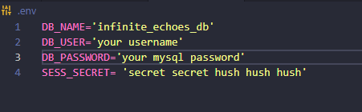

## Description

Having a place to go to share your thoughts and read what other have said is what the internet is made for. In this project I aimed to create a full-stack blog site where people can signup for an account and post articles for others to read what they have to say. Users can leave comments to let the authors know what they feel and give suggestions or critics if they wish. Authors can then take in that feedback to either edit their article or rewrite the article.

A challenge faced in this project was starting from scratch and building the back-end and connecting it to the front-end within limited time (4 days). It being the first full-stack project I have undertaken, it was a challenge to get it all complete in time.

Future development would consist around refining the CSS outside of the homepage to link better to the homepage. Future development would also see converting the usage of handlebars.js to react.js

A link to the deployed site can be found [here](https://hidden-brook-25016-916a523caf29.herokuapp.com/)

## Table of Contents

- [Installation](#installation)
- [Usage](#usage)
- [License](#license)
- [Contributing](#contributing)
- [Test](#test)
- [Questions](#questions)
- [Credit](#credit)

## Installation

### Programs needed for this project:

- GitBash (windows) or Terminal (Mac)
- Node.js
- Inquirer
- mySQL2
- Insomnia

Locate a suitable place where you would like to download this repository. Once found, copy the repositories SSH or HTTPS to clone through the terminal or download the zipfile from GitHub. After it is downloaded, please ensure that node.js is installed. Once it is installed and at least version 18 or higher, go to your terminal, navigate to the directory that contains this repository. Once there, type in "npm i" to download the required dependencies.

Before launching the application, a mySQL server must be up and running. From the integrated terminal or the command line, please type in "mysql -u root -p" if your mysql account has a password or "mysql -u root" if you do not have a password set up. Once the server has been connected, please navigate to the db folder and type in "SOURCE schema.sql;".

Once the mySQL server is up and running please create a .env file at the level of server.js. Within that .env file be sure it looks like the following framework with your information filled in for the DB_user & DB_password:

When that .env file is completed navigate to the server.js level and open up a terminal and type in "npm run seed". From there type in "npm run start", "npm start", or "node server.js". Once the server is up, you should see a listening message in the terminal signaling it is on. Navigate over to a browser of your choice and go to http://localhost:3001 to interact with this application.

## Usage

This repository is allowed for use in a learning environment to evaluate and analyze.

## License

    Please see the MIT license found in the repository. To learn more, please click the license badge at the top of the README.MD

## Contributing

- Sequelize for their [modules](hhttps://sequelize.org/)
- mySQL2 for their [modules](https://www.npmjs.com/package/mysql2)
- dotenv for their [modules](https://www.npmjs.com/package/dotenv)
- Express for their [modules](https://expressjs.com/)
- nodemon for their [modules](https://www.npmjs.com/package/nodemon)
- Hyperplexed for their tutorials on [CSS animations](https://www.youtube.com/c/Hyperplexed)
- UCI BootCamp for the acceptance criteria.
- AskBCS for their assistance in troubleshooting.

## Questions

If you have further questions about this project, please send an email or checkout us out on GitHub.

Email: kyleochata@gmail.com

GitHub Link: https://github.com/kyleochata

## Credit

This project was created by Kyle Etrata
